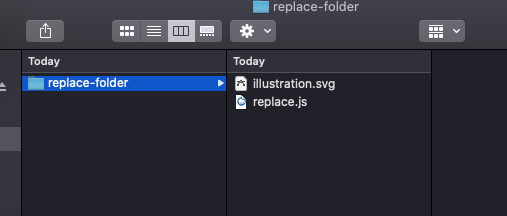
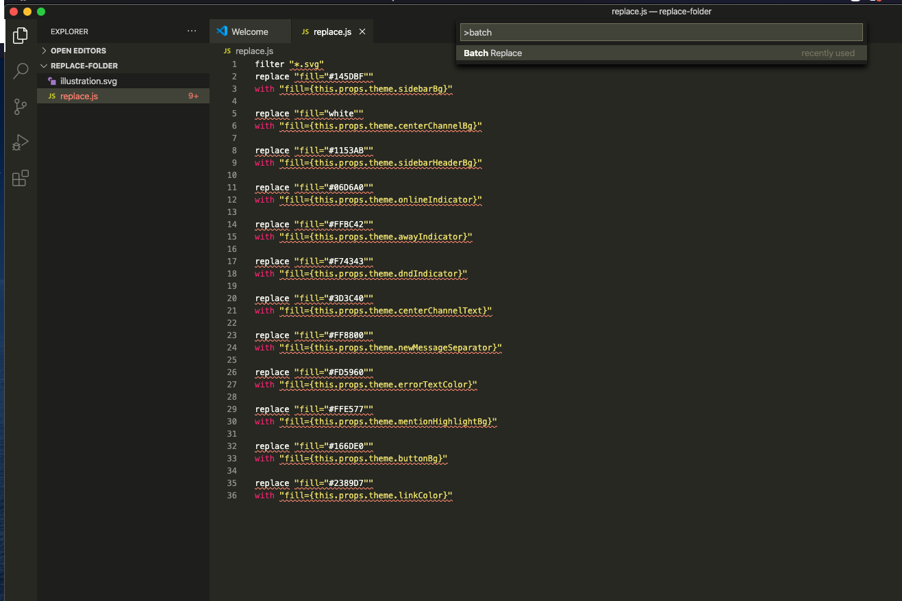

# Mattermost Theme Compatible Illustrations
Make your illustrations theme compatible in the Mattermost system

This script allows you to make your Illustrations theme compatible.

### 1. Download VS Code

### 2. Download [Batch Replacer Plugin](https://marketplace.visualstudio.com/items?itemName=angelomollame.batch-replacer) in VSCode

### 3. Download the replace-folder in this repository

### 4. Place the svg you wish to make theme compatible in the repository folder you have downloaded (Mattermost Theme Replace).

### 5. Run Batch Replacer command in VSCode

### Done!

---------

### Video Tutorial

